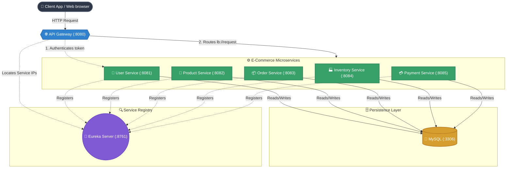

# 🛒 E-Commerce Microservices


A scalable e-commerce microservices architecture built with **Java 21** and **Spring Boot 3.4**. This project demonstrates best practices for building distributed systems with microservices patterns including service discovery, API gateway routing, JWT authentication, and inter-service communication.

> **Status:** Actively Maintained & Production Ready 🚀

## 📋 Table of Contents

- [Overview](#-overview)
- [Architecture](#️-architecture)
- [Project Structure](#-project-structure)
- [Technologies](#️-technologies)
- [Prerequisites](#-prerequisites)
- [Environment Variables](#-environment-variables)
- [Installation & Setup](#-installation--setup)
- [Running the Services](#-running-the-services)
- [API Documentation](#-api-documentation)
- [Testing](#-testing)
- [Contributing](#-contributing)
- [License](#-license)

## 🎯 Overview

This e-commerce microservices platform is designed to provide a modular, scalable, and maintainable solution for online retail operations. Each service handles a specific business domain and communicates through the API Gateway.

**Key Features:**
- 🏗️ Microservices-based architecture with Spring Boot
- 🔍 Service Discovery using Netflix Eureka
- 🌐 Dynamic API Gateway routing (`lb://` load-balanced URIs)
- 🔐 JWT-based authentication and authorization
- 📦 RESTful CRUD APIs for all domains
- 🗄️ MySQL database with seed data for all services
- 🔒 Secure configuration using environment variables (no hardcoded credentials)

## 🏗️ Architecture



## 📁 Project Structure

```
java-spring-microservices/
│
├── discovery-service/         # Eureka Service Registry (port 8761)
│   └── src/
│
├── api-gateway/               # API Gateway with JWT filter (port 8080)
│   └── src/
│
├── user-service/              # User management & JWT auth (port 8081)
│   └── src/
│
├── product-service/           # Product catalog (port 8082)
│   ├── src/.../model/Product.java
│   ├── src/.../controller/ProductController.java
│   └── src/main/resources/data.sql
│
├── order-service/             # Order processing (port 8083)
│   ├── src/.../model/Order.java, OrderItem.java
│   ├── src/.../controller/OrderController.java
│   └── src/main/resources/data.sql
│
├── inventory-service/         # Inventory management (port 8084)
│   ├── src/.../model/Inventory.java
│   ├── src/.../controller/InventoryController.java
│   └── src/main/resources/data.sql
│
├── payment-service/           # Payment processing (port 8085)
│   ├── src/.../model/Payment.java
│   ├── src/.../controller/PaymentController.java
│   └── src/main/resources/data.sql
│
├── pom.xml                    # Parent POM (multi-module aggregator)
└── docker-compose.yml         # Infrastructure setup
```

## 🛠️ Technologies

| Category | Technology |
|---|---|
| **Framework** | Spring Boot 3.4.1 |
| **Language** | Java 21 |
| **Build Tool** | Maven (multi-module) |
| **Service Discovery** | Netflix Eureka |
| **API Gateway** | Spring Cloud Gateway |
| **Security** | Spring Security + JWT |
| **Database** | MySQL 8.x |
| **ORM** | Hibernate / Spring Data JPA |
| **Container** | Docker & Docker Compose |

## ✅ Prerequisites

Before you begin, ensure you have the following installed:

- ☕ Java JDK 21 or higher
- 📦 Maven 3.6 or higher
- 🐬 MySQL 8.x (running on port 3306)
- 🔧 Git
- 🐳 Docker Desktop (for containerization)
- 💻 IDE: IntelliJ IDEA or VS Code with Java extensions

## 🔒 Environment Variables

This project uses **environment variables** for all sensitive configuration. No credentials are hardcoded in the source code.

### Required Variables

| Variable | Description | Default |
|---|---|---|
| `DB_HOST` | MySQL server hostname | `localhost` |
| `DB_PORT` | MySQL server port | `3306` |
| `DB_USERNAME` | MySQL username | `root` |
| `DB_PASSWORD` | MySQL password | *(empty)* |
| `JWT_SECRET` | Base64-encoded JWT signing key | *(default dev key)* |
| `JWT_EXPIRATION` | JWT token expiration in ms | `86400000` (24h) |

> **Note:** Each service uses a different database name (`DB_NAME`), which is pre-configured in each service's config file. You only need to set the connection credentials.

### Set Environment Variables

**macOS / Linux:**
```bash
export DB_USERNAME=root
export DB_PASSWORD=your_mysql_password
export JWT_SECRET=your_base64_encoded_secret_key
```

**Windows (PowerShell):**
```powershell
$env:DB_USERNAME="root"
$env:DB_PASSWORD="your_mysql_password"
$env:JWT_SECRET="your_base64_encoded_secret_key"
```

**Or add to `~/.zshrc` / `~/.bashrc` for persistence:**
```bash
echo 'export DB_USERNAME=root' >> ~/.zshrc
echo 'export DB_PASSWORD=your_mysql_password' >> ~/.zshrc
echo 'export JWT_SECRET=your_base64_encoded_secret_key' >> ~/.zshrc
source ~/.zshrc
```

## 🚀 Installation & Setup

### 1. Clone the Repository

```bash
git clone https://github.com/JateenDhaduk/e-com-mircoservice-main.git
cd e-com-mircoservice-main
```

### 2. Create MySQL Databases

```sql
CREATE DATABASE IF NOT EXISTS ecom_user_db;
CREATE DATABASE IF NOT EXISTS ecom_product_db;
CREATE DATABASE IF NOT EXISTS ecom_order_db;
CREATE DATABASE IF NOT EXISTS ecom_inventory_db;
CREATE DATABASE IF NOT EXISTS ecom_payment_db;
```

### 3. Set Environment Variables

```bash
export DB_USERNAME=root
export DB_PASSWORD=your_password
```

### 4. Build the Project

```bash
cd java-spring-microservices
mvn clean install -DskipTests
```

## 📦 Running the Services

### Start Order (Important!)

**Always start the Discovery Service first**, then the Gateway, then the business services.

```bash
# Terminal 1: Discovery Service (must start first)
mvn spring-boot:run -pl discovery-service

# Terminal 2: API Gateway
mvn spring-boot:run -pl api-gateway

# Terminal 3-7: Business Services (any order)
mvn spring-boot:run -pl user-service
mvn spring-boot:run -pl product-service
mvn spring-boot:run -pl order-service
mvn spring-boot:run -pl inventory-service
mvn spring-boot:run -pl payment-service
```

### Verify Services are Running

- **Eureka Dashboard:** [http://localhost:8761](http://localhost:8761) — shows all registered services

| Service | Port | Health Check |
|---|---|---|
| API Gateway | 8080 | `curl http://localhost:8080/actuator/health` |
| User Service | 8081 | `curl http://localhost:8081/actuator/health` |
| Product Service | 8082 | `curl http://localhost:8082/actuator/health` |
| Order Service | 8083 | `curl http://localhost:8083/actuator/health` |
| Inventory Service | 8084 | `curl http://localhost:8084/actuator/health` |
| Payment Service | 8085 | `curl http://localhost:8085/actuator/health` |

## 📚 API Documentation

All requests go through the **API Gateway** on port `8080`:

### Product Service

| Method | Endpoint | Description |
|---|---|---|
| `GET` | `/api/products` | Get all products |
| `GET` | `/api/products/{id}` | Get product by ID |
| `GET` | `/api/products/category/{c}` | Get products by category |
| `GET` | `/api/products/search?name=` | Search products by name |
| `POST` | `/api/products` | Create new product |
| `PUT` | `/api/products/{id}` | Update product |
| `DELETE` | `/api/products/{id}` | Delete product |

### Order Service

| Method | Endpoint | Description |
|---|---|---|
| `GET` | `/api/orders` | Get all orders |
| `GET` | `/api/orders/{id}` | Get order by ID |
| `GET` | `/api/orders/user/{userId}` | Get orders by user |
| `POST` | `/api/orders` | Create new order |
| `PUT` | `/api/orders/{id}/status` | Update order status |
| `DELETE` | `/api/orders/{id}` | Cancel order |

### Inventory Service

| Method | Endpoint | Description |
|---|---|---|
| `GET` | `/api/inventory` | Get all inventory |
| `GET` | `/api/inventory/product/{productId}` | Get stock for product |
| `GET` | `/api/inventory/product/{id}/in-stock` | Check if in stock |
| `POST` | `/api/inventory` | Add inventory record |
| `PUT` | `/api/inventory/product/{id}/quantity` | Update stock quantity |

### Payment Service

| Method | Endpoint | Description |
|---|---|---|
| `GET` | `/api/payments` | Get all payments |
| `GET` | `/api/payments/{id}` | Get payment by ID |
| `GET` | `/api/payments/order/{id}` | Get payment for order |
| `POST` | `/api/payments` | Process a payment |
| `POST` | `/api/payments/{id}/refund` | Refund a payment |

### User Service

| Method | Endpoint | Description |
|---|---|---|
| `POST` | `/api/users/register` | Register a new user |
| `POST` | `/api/users/login` | Login and get JWT token |
| `GET` | `/api/users/{id}` | Get user by ID |

## 🧪 Testing

Run tests for all services:

```bash
mvn test
```

Run tests for a specific service:

```bash
mvn test -pl product-service
```

## 📝 Contributing

1. Fork the repository
2. Create a feature branch: `git checkout -b feature/your-feature`
3. Commit changes: `git commit -am 'Add new feature'`
4. Push to branch: `git push origin feature/your-feature`
5. Submit a pull request

## 📄 License

This project is licensed under the MIT License - see the LICENSE file for details.

## 👨‍💻 Author

**Jateen Dhaduk**

- GitHub: [@JateenDhaduk](https://github.com/JateenDhaduk)
- Email: jateendhaduk456@gmail.com

---

**Last Updated:** April 2026

**Version:** 3.0.2
